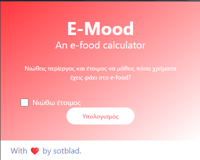
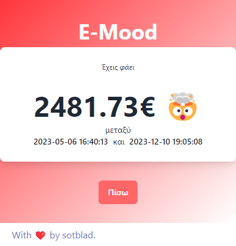
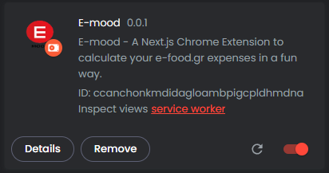

# E-mood  🚀  

E-mood is a Next.js Chrome Extension that calculates your e-food.gr expenses in a fun way.

## Table of Contents ✨  

- [Description](#description)
- [Installation](#installation)
- [Usage](#usage)
- [Contributing](#contributing)

# Description

E-mood is developed as a fun little project for my favorite food delivery platform, E-food.gr, because I was always wondering how much money I have spent on it during my University studies which I'm not able to view automatically on-site.






# Installation

1. Clone this repository: 

   ```bash
   git clone https://github.com/sotblad/e-mood.git
   ```
2. Navigate to project directory: 

   ```
   cd e-mood
   ```
4. Install the dependencies using npm: 
   ```
   npm install
   ```

# Usage
## Usage Locally  🔥

Run the project:
```
npm run dev
```
`This will run project on your localhost`

 http://localhost:3000/

## Build and Import To Chrome 🔥

1. Build the project:
```
npm run build
```
`This will run prep and export to create new folder 'out/', and rename '_next' forlder to 'next' (without underscore)`

2. Open Google Chrome and go to chrome://extensions.


3. Enable the "Developer mode" toggle switch.

4. Click on "Load unpacked" and select the out folder generated by the build process.

5. The E-mood extension should now be loaded as an unpacked extension in Google Chrome.




# Contributing
Contributions to the E-mood extension are welcome! If you find any issues or have suggestions for improvements, please feel free to open an issue or submit a pull request.
